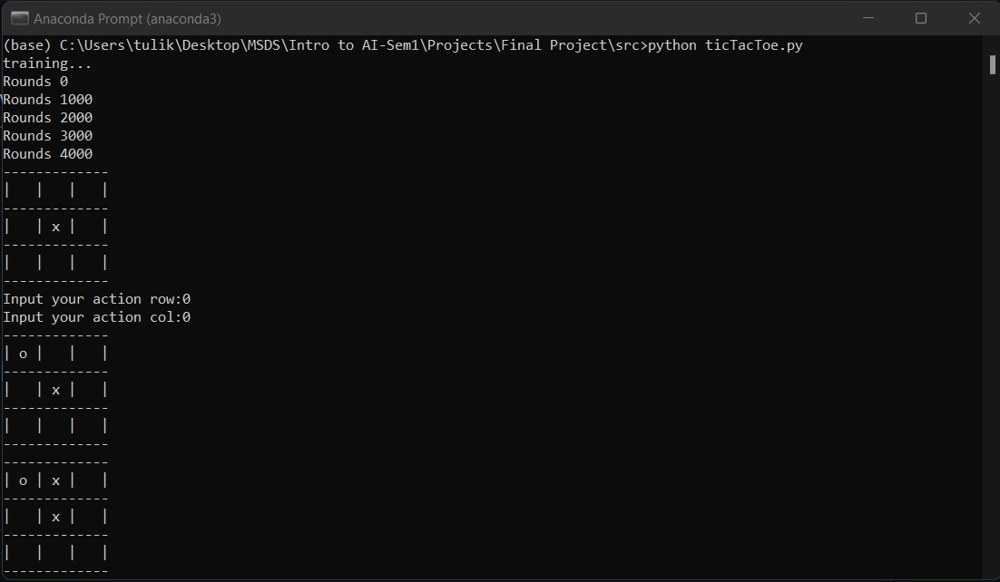
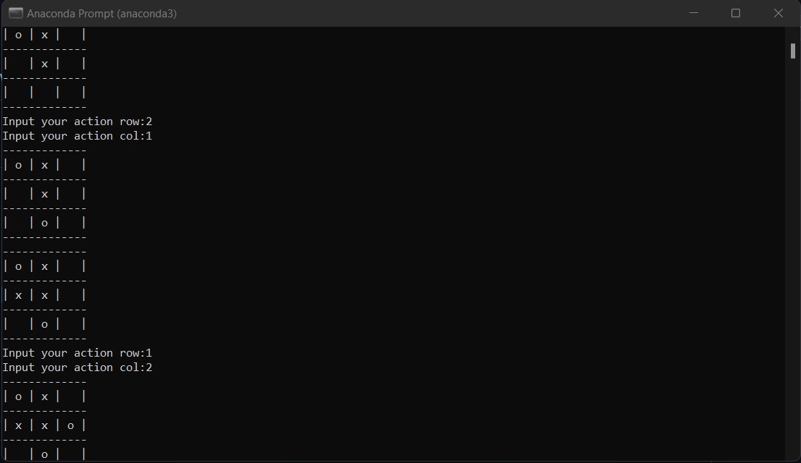
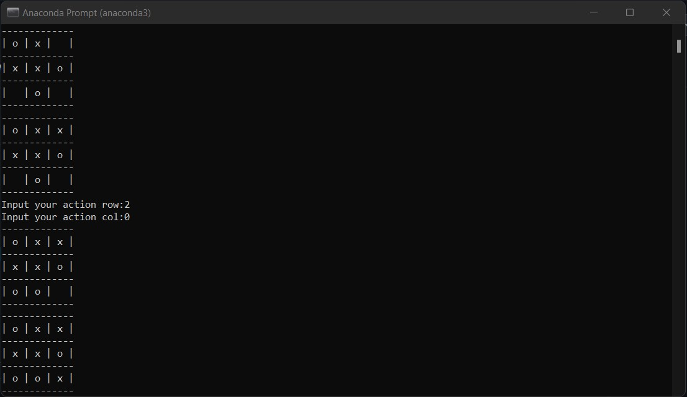
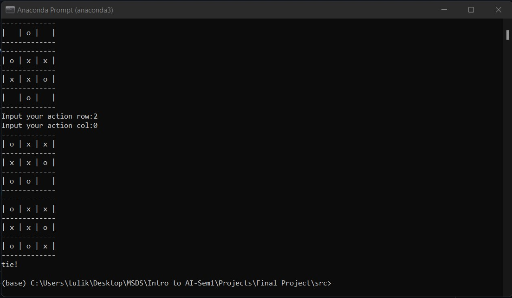
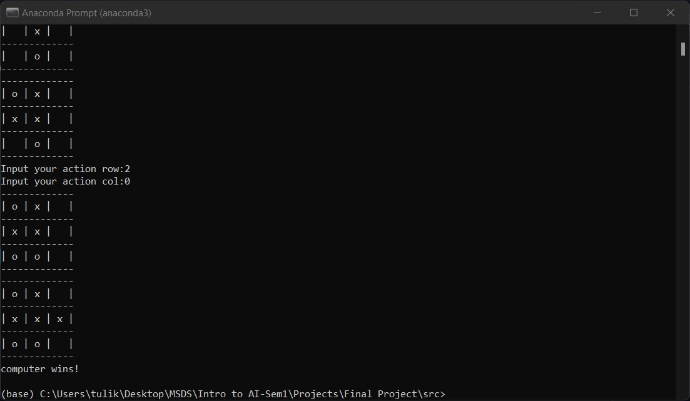

# Noughts-and-Crosses-Agents

This is the final submission of the Term Project for Introduction to Artificial Intelligence (DSCI-6612-01) for Fall 2021. The group members of this project are Tulika Kotian and Yashpreet Malhotra.

This AI project implements the Noughts & Crosses game (also famously known as the Tic-Tac-Toe) game using different artificial intelligence agents. We have implemented the game using the following four agents with their variations: Minimax agent, Minimax with alpha beta pruning, Expectimax agent, Q learning, and approximate Q learning.
What is the Noughts & Crosses game?A game in which two players alternately put Xs and Os in a grid of a figure formed by two vertical lines crossing two horizontal lines and each tries to get a row of three X’s or three O’s before the opponent does. 

The player who succeeds in placing three of their marks in a horizontal, vertical, or diagonal row is the winner. It is a solved game, with a forced draw assuming best play from both players.

## Objectives of this project:
The objectives of this project are to:
* Design Minimax, Expectimax and Q-Learning Algorithm agents to solve the Tic-Tac-Toe game.
* Play the Tic-Tac-Toe with the designed model.
* Tic-Tac-Toe game logic depends on: Each puzzle consists of a grid containing X's and O's in various places. The object is to place X or O in remaining squares so:
  * There are no more than three consecutive X's or O's in a row or a column in the entire grid.
  * All rows and all columns have unique combinations of X’s and O’s.
  
## Approach of the game:
### Game Layout:
* Training the agent about the Tic-tac-toe environment.
* Define the agent which minimizes our utility.
* Develop a counter strategy for ourselves to maximize our utility.
* We are using expectimax to decrease the limitations of minimax and further expand our utility.
* Then we add a choice node to study actions of the agent and use Q learning to get the max utility.

The state of this game is the board state of both the agent and its opponent, so we will initialize a 3x3 board with zeros indicating available positions and update positions with 1 if player 1 takes a move and -1 if player 2 takes a move. The action is what positions a player can choose based on the current board state. Reward is between 0 and 1 and is only given at the end of the game.

The player who succeeds in placing three of their marks in a horizontal, vertical, or diagonal row wins the game. 

## Agents implemented:
* Minimax algorithm (with alpha-beta pruning)
* Expectimax algorithm
* Q-learning 
* Approximate Q-learning

## Minimax algorithm:
Minimax is a recursive algorithm which is used to choose an optimal move for a player assuming that the opponent is also playing optimally. As its name suggests, its goal is to minimize the maximum loss (minimize the worst case scenario)

The key to the Minimax algorithm is a back and forth between the two players, where the player whose "turn it is" desires to pick the move with the maximum score. In turn, the scores for each of the available moves are determined by the opposing player deciding which of its available moves has the minimum score.

This function evaluates all the available moves using minimax() and then returns the best move the maximizer can make.

## Expectimax algorithm:
The Expectimax search algorithm is a game theory algorithm used to maximize the expected utility. It is a variation of the Minimax algorithm. While Minimax assumes that the adversary(the minimizer) plays optimally, Expectimax doesn’t. This is useful for modelling environments where adversary agents are not optimal, or their actions are based on chance.

Expectimax algorithm helps take advantage of non-optimal opponents.
Unlike Minimax, Expectimax ‘can take a risk’ and end up in a state with a higher utility as opponents are random(not optimal).

The Chance nodes take the average of all available utilities giving us the ‘expected utility’.

## Q-learning algorithm:
Whereas in general game theory methods, say min-max algorithm, the algorithm always assume a perfect opponent who is so rational that each step it takes is to maximize its reward and minimize our agent reward, in reinforcement learning it does not even presume a model of the opponent and the result could be surprisingly well.

To formulate this reinforcement learning problem, the most important thing is to be clear about the 3 major components — state, action, and reward. Firstly, train 2 agents to play against each other and save their policy for 5000 rounds. Secondly, load the policy and make the agent to play against human

We need a player class which represents our agent, and the player is able to:
* Choose actions based on current estimation of the states.
* Record all the states of the game.
* Update states-value estimation after each game.
* Save and load the policy.

## Results & Analysis:
In every game attempt, we get the correct tic-tac-toe formation, in a way that the agent wins the game. hence the constraints are satisfied accurately.

## Execution instructions:
Run the ticTacToe.py file to run the game.

## Requirements:
Python 3.8
